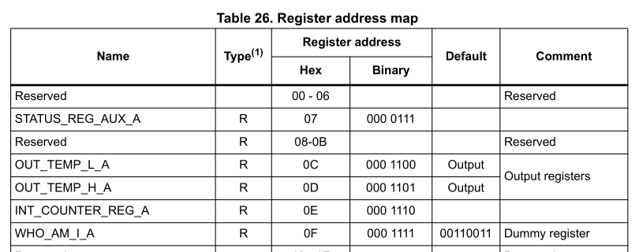
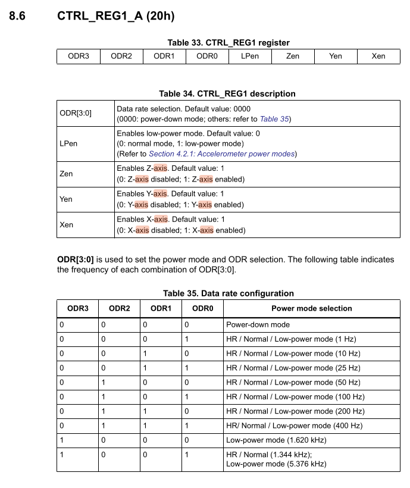
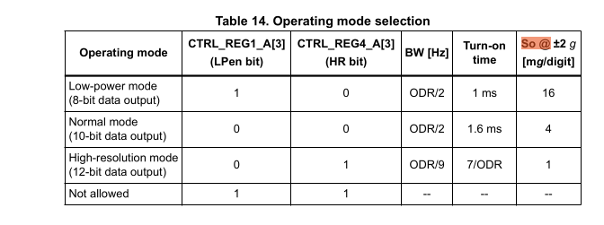

# Accelerometer Sensor Driver

The micro:bit v2 has an on-board LSM303AGR e-compass module. Writing device drivers is a common
task in our domain, so that is what we are going to do in this exercise. There are open-source
drivers [available](https://docs.rs/lsm303agr/latest/lsm303agr/), but we are going to write a new
one so you can actually learn how this process works. This is an on-board [MEMS](https://en.wikipedia.org/wiki/MEMS)
sensor. It's tiny! You can see where it is located on the board on the [website](https://tech.microbit.org/hardware/#overview).
Look for the ST LSM303AGR on the board images.

This is a capable MEMS sensor which has confusing sections in its [datasheet](https://www.st.com/en/mems-and-sensors/lsm303agr.html).
It uses a lot of abbreviations and expects implicit knowledge. This is unfortunately something that is very
common in datasheets written by hardware companies. We have looked at the datasheet and extracted the most
relevant knowledge by also looking at available drivers provided by the community so you do not have
to do this guesswork anymore.

The goal of this exercise is to write a very rudimentary driver which can be used to read the
acceleration values. While it might be a bit more relevant to implement the magnetometer
reading for our applications (satellite systems without propulsion), the accelerometer gives
a nice visualization without requiring a rod magnet to verify sensor readings. The basic principles
of reading and converting raw sensor values remains the same and can be transferred to other
sensors.

## Features of the hardware sensor

Let's have a look at the feature set of that sensor first by looking at the [micro:bit docs](https://tech.microbit.org/hardware/#motion-sensor):

- e-compass which combines a magnetometer and and accelerometer into one package
- Configurable range of 2/4/8/16g
- Configurable resolution of 8/10/12 bits

The sensor also has an output data rate (ODR) configuration which specifies how often the sensor
updates its internal value. Let's make some requirements for our driver so simplify our task:

- Our simple driver will only support +- 2g.
- Only support normal resolution of 10 bits.
- Configurable ODR settings.

The sensor has two communication interfaces: I2C and SPI. However, by looking at the
HW schematic:


We can see that the sensor is connected through I2C. An in-depth explanation of the I2C (or SPI)
bus would exceed the scope of this exercise, but the most relevant key information from a software
engineering perspective are summarized here:

- I2C allow communication between multiple devices through two GPIO pins only. One clock is the
  data pin which is called the serial data line (SDA) and the other pin is called the serial clock
  (SCL)
- The most common I2C communication speeds are normal mode with 100 kHz and fast mode with 400 kHz.
- I2C relies of device addressing to allow talking to a single device on a shared bus.
- An I2C transaction can be abstracted with three operations: `read`, `write` and `read_write`.

The Rust embedded-hal crate provide generic traits that portable device drivers and HAL implementations
need to agree on. You can have a look at how these basic bus properties were captured in the
[I2C trait](https://docs.rs/embedded-hal/1.0.0/embedded_hal/i2c/trait.I2c.html). Notice how its
API functions expect a device address and are named `read`, `write` and `read_write`.

We are not going to use this trait directly for this exercise, but the trait would be relevant
if you either want to write a driver which works on multiple hardware platforms, or if you
want a driver which works with both exclusive bus access and when sharing the bus with multiple
other devices.

Looking at the [pin map](https://tech.microbit.org/hardware/schematic/#v2-pinmap), we can figure
out that the SDA pin is mapped to P0.16 and the SCL pin is mapped to P0.08. There are also
external I2C pins, but those are routed to the edge connector and are used to connect
external devices.

When it comes to writing device drivers, you will generally wrap the communication driver object 
in your driver. For this device, you would wrap some I2C driver. We can omit some abstraction
because we know that we are never going to share the bus,
and we do not want to write a portable driver. This means we can wrap the bus driver provided
by the HAL. Nordic uses a different name for the I2C protocol and calls it TWI (two-write interface).
There is a [`twim`](https://docs.embassy.dev/embassy-nrf/git/nrf52833/twim/index.html) providing
support for the Two Wire Interface in master mode, which is relevant for us.

## Step 1 - Create the I2C/TWI driver

Open the `src/bin/motion_sensor.rs` file. Start creating the [`twim` driver](https://docs.embassy.dev/embassy-nrf/git/nrf52833/twim/struct.Twim.html) and storing it into an object named `i2c_bus`.
We provided all required information, including the pin mapping for the SDA and SCL pin.
The default TWI configuration provided by embassy is sufficient for our purposes. The name of
the peripheral in the library are `TWISPI0`. You can assume that a TX RAM buffer of 16 or 32 bytes
is sufficient.

If you are struggling with this step and you have not worked through the [blinky](./blinky-exercise.md)
or the [UART echo](./uart-echo-exercise.md) exercise yet, you should work through those first.

If you do not remember the exact syntax for creating the interrupt bindings, you can look at
the [embassy example](https://github.com/embassy-rs/embassy/blob/main/examples/nrf52840/src/bin/twim.rs)
or at the details:

<details>

```rust
pub use embassy_nrf::{twim, peripherals};

bind_interrupts!(struct Irqs {
    TWISPI0 => twim::InterruptHandler<peripherals::TWISPI0>;
});
```
</details>

Rest of solution:

<details>

```rust
    let mut tx_ram_buffer: [u8; 32] = [0; 32];
    let i2c_config = twim::Config::default();
    let i2c_bus = embassy_nrf::twim::Twim::new(
        periphs.TWISPI0,
        Irqs,
        periphs.P0_16,
        periphs.P0_08,
        i2c_config,
        &mut tx_ram_buffer,
    );
```

</details>

## Step 2 - Create the basic driver object

You are now going to create a driver object instead of just re-using existing library code in your
application. Go into the `src/motion_sensor.rs` file which is part of the crate library. This
file/module is already included in `src/lib.rs` for you, but it is empty. Start by creating a empty
structure named `Accelerometer` here.

Then add one field to that structure: The I2C driver you just created. You actually need a lifetime
of `Accelerometer` now because the I2C driver has a lifetime as well.

<details>

```rust
pub struct Accelerometer<'d> {
    i2c: embassy_nrf::twim::Twim<'d>
}
```

</details>

## Step 3 - Add a constructor

Add a constructor to your driver object by adding a `new` method with returns `Self`. In the most
simple form, the constructor could simply take the I2C bus as an input argument and then create and
return itself.

However, we also want to verify that the communication with out device works properly. Sensors
from ST microelectronics commonly have a WHO AM I register which you can read to verify
basic sensor communication. The value read from this register should have a fixed value that
you can check. Your task is to add a constructor which constructs `Accelerometer`, checks the
communication and returns `Result::Ok(Self)` on success and some error if the I2C communication fails
or the WHO AM I register value is invalid.

You can use an `enum` to model an error which can
either be an [`embassy_nrf::twim::Error`](https://docs.embassy.dev/embassy-nrf/git/nrf52833/twim/enum.Error.html)
or some WHO AM I error unit variant. Add an asynchronous constructor function and start with an empty
`todo!()` implementation block.

If you feel confident in your Rust abilities, try to solve this without using hints and
intermediate solutions.

The constructor will have a basic form like this, including a suitable initialization error type:

<details>

```rust

#[derive(Debug)]
pub enum InitError {
    I2c(embassy_nrf::twim::Error),
    WhoAmIInvalid
}

impl<'d> Accelerometer<'d> {
    // Constructor.
    pub async fn new(mut i2c: embassy_nrf::twim::Twim<'d>) -> Result<Self, InitError> {
        todo!();
        // Implementation
        // ...
    }
}
```

</details>

But how do you actually read back this value using I2C? On this device, you can read a register
by first sending the register ID you want to read and then reading back one byte.

The register map can be found in the [device datasheet](./assets/lsm303agr.pdf). We have
included an excerpt of the register map on page 43 for you:



Create a `enum` which includes the Register IDs, for example one named `Register`.
Add the `WhoAmI` variant with the correct register address value. Derive `Debug`, `Copy`, `Clone`,
`defmt::Format`, `PartialEq` and `Eq` on it.

<details>

```rust

#[derive(Debug, Copy, Clone, PartialEq, Eq, defmt::Format)]
pub enum Register {
    WhoAmI = 0x0f
}
```

</details>

You can add new values to the `enum` as you need them. Or you put in a lot of work and create a complete one.
AI can help with this menial job.

Now you have everything you need to read the value. You have to use the `write_read` API.
We already provided hints what you have to send and how much you have to read back. Read back
the WHO AM I register and verify its value. From the datasheet, we can determine the expected value
to be `0b00110011`. You can create a constant or associated constant on the `Accelerometer` object
to store the expected value.

We mentioned that you always have to pass the device address when using the I2C driver
API. For the accelerometer, that address has a fixed value of `0x19` that you can retrieve
from the microbit v2 schematic or from the sensor datasheet. Create an associated constant
`ADDR` on the `Accelerometer` driver which has that value.

<details>

```rust
impl Accelerometer<'_> {
    pub const ADDR: u8 = 0x19;
}

```

</details>

Now you have everything you need to write the constructor. Finish the implementation for the `new`
method. Return some error variant if the read back
value is not equal to the expected one, and return a driver instance otherwise.

<details>

```rust

impl<'d> Accelerometer<'d> {
    pub async fn new(mut i2c: embassy_nrf::twim::Twim<'d>) -> Result<Self, InitError> {
        let mut buf = [0; 1];
        i2c.write_read(Self::ADDR, &[Register::WhoAmIAcc as u8], &mut buf)
            .await?;
        if buf[0] != Self::WHO_AM_I_VALUE {
            return Err(InitError::InvalidWhoAmI);
        }
        Ok(Self { i2c })
    }
}

impl Accelerometer<'_> {
    pub const ADDR: u8 = 0x19;
    pub const WHO_AM_I_VALUE: u8 = 0b00110011;
}
```

</details>

The interaction with other registers is comparable. In general if you want to read registers,
you still have to use `read_write` to select the correct registers, while you can just use
`write` if you only want to write to a register.

## Step 4 - Configure the sensor

Now you have a driver instance, but you actually want to read some sensor values. We tried
this for you before, and wondered why the accelerometer readings returned all zero. It turns
out you need to write some configuration registers to actually enable the device. Let's do this
first.

We extracted the definition of `CTRL_REG1_A` on page 47 of the datasheet for you:



The device is in Power-Down mode on startup. This is the most important control register
because it allows use to set the output data rate (ODR), enabling the device and
individual axes. The datasheet specifies a 8-bit register configuration.

- Bits 7 down to 4 are the ODR3 to ODR0 configuration bits
- Bit 3 is the low power enable bit
- Bits 2 down to 0 enable the axes Z, Y, and X respectively

We are going to use a crate called `bitbybit` which provides a declarative way to specify
registers and then provides a convenient API to build the register value which avoids
the need to write bitshifts and masks.

Have a look at the examples from the [`bitbybit`](https://github.com/danlehmann/bitfield)
crate and try to specify this registeres using `bitbybit::bitfield`. Adding `default = 0x0`
inside proc macro attributes also adds a builder API which is useful for us while `debug` adds
an improved `Debug` implementation. This can be combined with the
[`arbitrary-int`](https://docs.rs/arbitrary-int/latest/arbitrary_int/index.html) library.
We can also use `bitbybit::bitenum` to model the ODR configurations with an `enum`.

If you have worked with these libraries before, try to create the data structures using
those libraries. Otherwise, have a look at the solution and try to understand them by
cross-checking them with the register definition we provided you above:

<details>

Inside the `src/accelerometer.rs` library file:

```rust
/// Output data rate configuration.
#[bitbybit::bitenum(u4, exhaustive = false)]
#[derive(Debug)]
pub enum OdrConfig {
    PowerDown = 0b0000,
    Odr1Hz = 0b0001,
    Odr10Hz = 0b0010,
    Odr25Hz = 0b0011,
    Odr50Hz = 0b0100,
    Odr100Hz = 0b0101,
    Odr200Hz = 0b0110,
    Odr400Hz = 0b0111,
    LowPower1620Hz = 0b1000,
    HrNormal1344HzLowPower5376Hz = 0b1001,
}

#[bitbybit::bitfield(u8, default = 0x0, debug)]
pub struct ControlReg1 {
    #[bits(4..=7, rw)]
    odr: Option<OdrConfig>,
    #[bit(3, rw)]
    low_power_enable: bool,
    #[bit(2, rw)]
    z_enable: bool,
    #[bit(1, rw)]
    y_enable: bool,
    #[bit(0, rw)]
    x_enable: bool,
}
```

</details>

Now you have everything you need to update the register. The excerpt of the datasheet also
shows the register ID, whic his `0x20`. Add the `CtrlReg1` variant to the `Register` enumeration
you created before. You can now use the [builder API](https://github.com/danlehmann/bitfield#setting-all-fields-at-once-using-the-builder-syntax) on `ControlReg1` to build the target
configuration.

Use `i2c.write` inside the constructor to write the `ControlReg1` to the right register ID,
using an ODR of 100 Hz. Remember that you can write a register by sending the register ID as the
first byte, and the register value as the second byte.

<details>

Updated constructor:

```rust
    pub async fn new(mut i2c: embassy_nrf::twim::Twim<'d>) -> Result<Self, InitError> {
        let mut buf = [0; 1];
        i2c.write_read(Self::ADDR, &[Register::WhoAmIAcc as u8], &mut buf)
            .await?;
        if buf[0] != Self::WHO_AM_I_VALUE {
            return Err(InitError::InvalidWhoAmI);
        }
        i2c.write(
            Self::ADDR,
            &[
                Register::CtrlReg1 as u8,
                ControlReg1::builder()
                    .with_odr(OdrConfig::Odr100Hz)
                    .with_low_power_enable(false)
                    .with_z_enable(true)
                    .with_y_enable(true)
                    .with_x_enable(true)
                    .build()
                    .raw_value(),
            ],
        )
        .await?;
        Ok(Self { i2c })
    }
```

</details>

## Step 5 - Read the raw accelerometer values

Now we can read the raw sensor values. By looking at the register mapping on page 43 of the
datasheet again, we can figure out the base addresses of the sensor readout:

- OUT_X_L_A at 0x28
- OUT_X_H_A at 0x29
- OUT_Y_L_A at 0x2A
- OUT_Y_H_A at 0x2B
- OUT_Z_L_A at 0x2C
- OUT_Z_H_A at 0x2D

As you can see, those registers are consecutive. They are also ordered in little endian
format, where the low byte is at the smaller memory address. This is relevant for creating
the raw `u16` binary value from the raw bytes in the correct order.

We could perform 6 individual reads on the addresses specified above. However, the device
has a register auto-increment feature that we can use. By setting bit 7 in the register ID
value to 1, we can tell the device to automatically increment the device address for the next
read. This allows us to read all 6 registers with one I2C `write_read` transaction.

Create a `AUTO_INCREMENT_MASK` constant or associated constant and set it to `0x80` or
`0b1000_0000`. Now add a method named `read_raw` to your driver which will return the sensor readout.

The `_raw` suffix makes it clear that those are raw sensor values which are not worth much on
their own and still require some processing and conversion to proper units.

What do we actually return? A simple way would be to return a `(u16, u16, u16)` tuple.
YOu can also create a dedicated named structure and this is what we are going to do.

Add a structure named `ReadoutRaw`, which has `x`, `y` and `z` public fields.
You can add common dervies like `Debug`, `Copy`, `Clone`, `defmt::Format` as well.


<details>

```rust
#[derive(Debug, defmt::Format)]
pub struct ReadoutRaw {
    pub x: u16,
    pub y: u16,
    pub z: u16,
}
```

</details>

Now you can specify the `async` `read_raw` method for your driver as well.

<details>

```rust
    pub async fn read_raw(&self) -> Result<ReadoutRaw, Error> {
        todo!();
    }
```

</details>

The method we specified in our solution only required a shared reference of the driver.
This makes sense, because we are not configuring anything in the driver. However, we still require
mutable access to the wrapped `i2c` driver because that is just the function prototype of the
`write_read` method. We can fix this by using [interior mutability](https://doc.rust-lang.org/book/ch15-05-interior-mutability.html).

Wrap the `i2c` field of the structure in a `core::cell::RefCell`. You also have to update the constructor.

<details>

```rust
use core::cell::RefCell;

pub struct Accelerometer<'d> {
    i2c: RefCell<embassy_nrf::twim::Twim<'d>>,
}
```

and inside constructor method, use `core::cell::RefCell::new(i2c)` to wrap the i2c driver in
a `RefCell`.

</details>

You can get a mutable reference to the `i2c` driver using `borrow_mut` on the
field without requiring mutable access to the driver now.

Next, you can write the actual implementation which reads the sensor values. Remember that you can
read all 6 registers with one transaction by setting the `AUTO_INCREMENT_MASK` bit on the register
start ID, which would be the `OUT_X_L_A` register in our case. Now you just have to specify an
appropriate receive buffer size to read 6 words starting at that address.


After you have read the 6 bytes into a raw buffer, you need to extract and convert them into
a raw `i16` for further conversion. You can use `u16::from_le_bytes` to do this conversion.

<details>

```rust

impl Accelerometer<'_> {
    pub const ADDR: u8 = 0x19;
    pub const WHO_AM_I_VALUE: u8 = 0b00110011;
    pub const AUTO_INCREMENT_MASK: u8 = 0x80;

    pub async fn read_raw(&self) -> Result<ReadoutRaw, Error> {
        let mut buf = [0; 6];
        self.i2c
            .borrow_mut()
            .write_read(
                Self::ADDR,
                &[Self::AUTO_INCREMENT_MASK | Register::OutXLowAcc as u8],
                &mut buf,
            )
            .await?;
        Ok(ReadoutRaw {
            x: u16::from_le_bytes([buf[0], buf[1]]),
            y: u16::from_le_bytes([buf[2], buf[3]]),
            z: u16::from_le_bytes([buf[4], buf[5]]),
        })
    }
}
```

</details>

## Step 6 - Convert and read the values in the SI unit mg

Those raw values are not worth much by themselves. There are some conversion steps that we
need to do. The datasheet specifies the raw binary format as a left-adjusted signed [two-complement number](https://en.wikipedia.org/wiki/Two%27s_complement).
There are 2 conversion steps require here:

1. Eliminate trailing bytes depending on the selected resolution. We specified that this device has different
   resolution rates represented by bits. We can assume normal resolution (10-bits). This means
   that our relevant value will be placed on bit positions 15 downto 6. The simplest way to
   performing this scaling is by right-shifting by 6.
2. Scale the result to achieve our value in SI units. The datasheet specifies the sensitivity
   for a full scale of += 2g in mg per digit. You need to multiply the raw value with that table
   value. However, that table value also need to lineary scale with the full scale.

A general formula for the acceleration which should have been provided in the datasheet but
is not for mysterious reasons, can therefore be written as:

$$
A_{mg} = (R \gg n) \times \left( S_{2g} \times \frac{FS}{2} \right)
$$

- R is the raw value
- S is the sensitivity value you can take from the table below. It is called SO in the table, which
  is an abbreviation for scale output.
- n is the resolution shift, which is 16 minus the number of resolution bits, e.g. 6 for 10-bit
  resolution.
- FS is the full scale value, e.g. 2 for +- 2g full scale.



You can assume FS to be +-2g which is the default full scale for the sensor.

We would like to write our driver in a way that allows changing the resolution and full scale
in the future. Introduce two new enumerations which allow modelling this: A `Mode` enumeration
and a `FullScale` enumeration in the library. The `Mode` enumeration should include the Power Down,
Low Power, Normal and High Resolution Mode. The `FullScale` should include all full scales that this
device supports. You can no specify enum variants with leading numbers, but you can use a
leading underscore to allow this. In the full scale enumeration, assign the actual full scale
value as the enum value.

<details>

```rust
#[derive(Debug, Clone, Copy, defmt::Format)]
pub enum FullScale {
    _2g = 2,
    _4g = 4,
    _8g = 8,
    _16g = 16,
}

#[derive(Debug, Clone, Copy, PartialEq, defmt::Format)]
pub enum Mode {
    /// Power down
    PowerDown,
    /// Low power (8-bit)
    LowPower,
    /// Normal mode (10-bit)
    Normal,
    /// High resolution (12-bit)
    HighResolution,
}
```
</details>

Now add a `resolution_shift` method to the `Mode` structure which returns the right-shift
value _n_ that you have to apply to the raw value.

Then, add a `scale_multiplier` method to the `Mode` enumeration which also takes a `FullScale` as
an argument and calculates the final multiplier which needs to be applied to the shifted raw
value.

<details>

```rust
impl Mode {
    pub const fn resolution_shift(&self) -> i16 {
        match self {
            Mode::PowerDown => 0,
            Mode::HighResolution => 4,
            Mode::Normal => 6,
            Mode::LowPower => 8,
        }
    }

    /// The table 14 specifies the scale output values at += 2g in mg/digit.
    ///
    /// At higher full scales, that value needs to be scaled as well. When using a full scale
    /// of 2, notice how the full scale cancels out with the division and you achieve the table
    /// values.
    pub const fn scale_multiplier(&self, full_scale: FullScale) -> u32 {
        let full_scale = full_scale as u32;
        match self {
            Mode::PowerDown => 1,
            Mode::LowPower => (16 * full_scale) / 2,
            Mode::Normal => (4 * full_scale) / 2,
            Mode::HighResolution => (1 * full_scale) / 2,
        }
    }
}
```
</details>

Now add a `mode` and `full_scale` field to your driver. Those have fixed values
for now, but you could make them configurable at a later point.

<details>

```rust
/// Driver for the LSM303AGR e-compass.
pub struct Accelerometer<'d> {
    i2c: RefCell<embassy_nrf::twim::Twim<'d>>,
    full_scale: FullScale,
    mode: Mode,
}
```
</details>

In the constructor, simply hardcode those fields to the default values the device has at startup,
which is +- 2g full scale and normal resolution mode.

Now, we will introduce a higher-level type which can be used to read the accelerometer values
in SI units. Add a new structure to your library called `Readout`. This structure should
include a `raw` field with the `ReadoutRaw` type, a `full_scale` and a `mode` field.

<details>

```rust
#[derive(Debug, defmt::Format)]
pub struct Readout {
    raw: ReadoutRaw,
    full_scale: FullScale,
    mode: Mode,
}
```

</details>

Now add the following API methods for `Readout`:

- `x_mg` which returns X axis value in mg as an `i32`.
- `y_mg` which returns Y axis value in mg as an `i32`.
- `z_mg` which returns Z axis value in mg as an `i32`.
- `xyz_mg` which returns the value of all axes in mg as a `(i32, i32, i32)`

Use the formula we specified above the the methods we added to do this.

<details>

```rust
impl Readout {
    /// X axis readout in mg.
    pub const fn x_mg(&self) -> i32 {
        (self.raw.x >> self.mode.resolution_shift()) as i32
            * self.mode.scale_multiplier(self.full_scale) as i32
    }

    /// Y axis readout in mg.
    pub const fn y_mg(&self) -> i32 {
        (self.raw.y >> self.mode.resolution_shift()) as i32
            * self.mode.scale_multiplier(self.full_scale) as i32
    }

    /// Z axis readout in mg.
    pub const fn z_mg(&self) -> i32 {
        (self.raw.z >> self.mode.resolution_shift()) as i32
            * self.mode.scale_multiplier(self.full_scale) as i32
    }

    /// XYZ axis readout in mg.
    pub const fn xyz_mg(&self) -> (i32, i32, i32) {
        (self.x_mg(), self.y_mg(), self.z_mg())
    }
}
```

</details>

Finally, we want to have a convenience method called `read` on our drier which
returns this `Readout` structure. Add that method and re-use the `read_raw` method
that you have already written to initialize the `raw` field of the `Readout` structure.
You can initialize the `full_scale` and `mode` field from the cached values of the driver.

<details>

```rust
impl Accelerometer<'_>
    // (other functions...)

    pub async fn read(&self) -> Result<Readout, Error> {
        Ok(Readout {
            raw: self.read_raw().await?,
            full_scale: self.full_scale,
            mode: self.mode,
        })
    }
}
```

</details>

## Step 7 - Print the accelerometer values inside a loop periodically

We finally have everything we need to periodically read the sensor values.
Go ahead and create the driver you have written inside your example application using the constructor
you have written.
The datasheet mentions a start-up time of 1.6 ms for our configuration.
Call the `read` method periodically inside a loop and print the xyz values using the
`xyz_mg` method and `defmt`.

<details>

```rust
    let accelerometer = Accelerometer::new(i2c_bus)
        .await
        .expect("creating motion sensor driver failed");
    // For normal mode, 1.6 ms turn-on time.
    Delay.delay_us(1600).await;

    loop {
        match accelerometer.read().await {
            Ok(reading) => {
                defmt::info!("Accelerations (mg): {}", &reading.xyz_mg());
            }
            Err(e) => {
                defmt::error!("i2c error: {}", e);
            }
        };
        Timer::after_millis(50).await;
    }

```
</details>

## Finishing Up

If you have done everything correctly, you should see output like this:


```console
-- micro:bit Accelerometer application --
0.003967 [INFO ] Accelerations (mg): (-48, -232, 980) (accelerometer_solution src/bin/accelerometer_solution.rs:43)
0.055694 [INFO ] Accelerations (mg): (-44, -228, 984) (accelerometer_solution src/bin/accelerometer_solution.rs:43)
```

Your acceleration values may vary slightly based on the orientation of your micro:bit. Regardless,
you should measure an acceleration of around 1g, whic his the normal force that counteracts gravity when the
device rests on a surface.

You can now try things like shaking the device to see how the x and y axis react to this.
If you have something to cushion the fall, you could also do a freefall test, which should make the
1g counter force you normally see disappear while the device is free-falling. You might also
see spikes when the micro:bit is suddenly decelerated after hits a surface after free-falling.

You might wonder why an e-compass module has an accelerometer. You can actually use an accelerometer
to account for device tilt combined with the magnetometer for the north direction measurement. This is
a basic form of sensor fusion which can be used to improve the quality of the compass.
