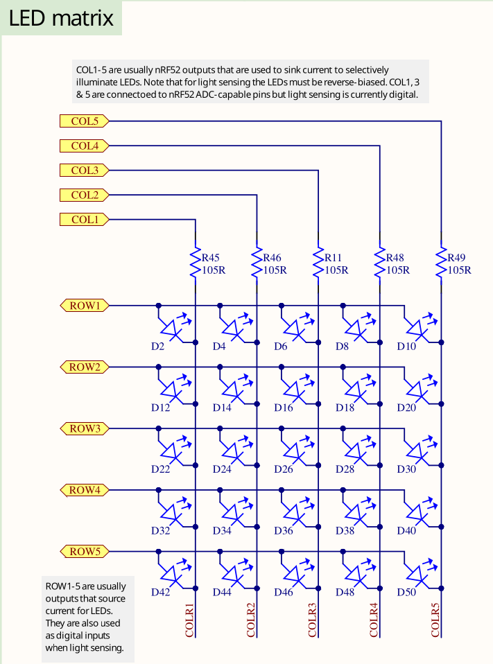
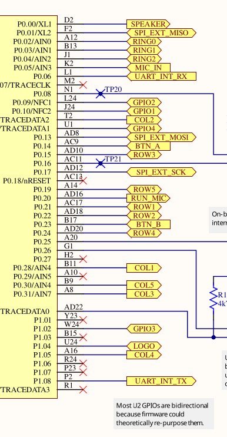

# Blinky Exercise

The end goal of this task is to make the LED D2, which is the LED is the upper left corner
of the LED matrix, blink with a frequency of 1 second.

It involves working with a general purpose Input/Output (GPIO) pin which is a very common task on
microcontrollers. It also involves a timing components to achieve the 1 second blink frequency.
In this exercise, you are going to build this application.

Go into the `microbit-code/exercises` directory. Inside the `src/bin/blinky.rs` file, you can
find the skeleton project that you should edit to work towards the blinky application. It includes
an explanation of the intermediate steps. Each intermediate step is explained in this document
in detail, including an intermediate solution.

You can find a full solution inside the `blinky_solution.rs` file.

Notice that you can always build and run the current state of your solution using

```sh
cargo run --bin blinky
```

## Some notes on the skeleton

Okay, there is not much here in this empty skeleton app, but you might still be interested in what
it does. 

The `#![no_std]` directive must be used because we do not have a standard runtime on our
microcontroller. The `#![..]` syntax applies this attribute to the whole module, which is our
whole application in this case. A standard runtime is usually only available on a full host system, for example
your development laptop. It usually includes components which make use of the operating systems,
for example filesystem handling, input/output libraries printing to the console, time libraries
and much more. We do not have an operating system, so this does not exist for our target.

The `#[no_main]` directive also applies to the whole module and must be used because we do not want
to use the default `main` method, which is the entry point of the program. This `main` method
would not exist for our bare-metal target anyway. Instead, we want to use an entry point method
provided and called by an external library. In this case,
[cortex-m-rt](https://docs.rs/cortex-m-rt/latest/cortex_m_rt/) is used.

The `use exercises as _;` line imports everything in the library `lib.rs`. `exercises` is the name
of the library/crate. Inside `lib.rs`, we are including some important tools:

- `use defmt_rtt as _;`: We want to use `defmt` as our logging library, and combine it with SEGGER RTT
   as the transport protocol.
- `use embassy_nrf as _;`: We need to include this for the compilation of our run-time library
   to work. It needs access to an interrupt vector structure which is imported as a side-effect of
   importing the HAL.
- `use panic_probe as _;`: We need to provide a `panic` handler for the compilation to work. This
   includes a panic handler provided by a library.

`#[embassy_executor::main]` is used to annotate our entry point. It allows that entry point
to be an `async` function as well.

The `async fn main(_spawner: Spawner) -> !` function prototype contains the following components:

- `async` because this is an asynchronous function. This allows us, among many other things, to
  use other `async` API inside the function
- The `!` return type means that this function should never return. A microcontroller software
  generally must run forever, because what would the system do if there is no more code to execute?
- The `spawner` argument can be used to spawn other `async` tasks. This is important for
  multi-tasking, but not relevant for us now. To avoid clippy/linter errors, a leading underscore
  was added to mark the unused argument.

Do not worry if you do not fully understand all of this! It is not necessary for practical programming
purposes. It is included once for completeness sake, because you will see these directives in
most `embassy` based programs.

## First step: Initializing the chip

We are using a hardware abstraction layer (HAL) library to simplify our job. If we did not use this,
we would have to use low-level register access code to interact with the hardware directly. That
is not really beginner friendly, so we will start with something more high-level. The HAL
introduced some basic abstraction, data structures and objects to interact with the hardware.

The nRF52833 chip which is part of the microbit v2 has some initialization which makes sense for
most firmware. This can include something like the clock initialization. When writing this HAL, it
makes sense packaging that configuration inside some initializer function.

Rust also has a nice type system which allows modelling of our problem domain. We have a
microcontroller which has [peripherals](./terminology_glossary.md) and physical pins. We can model
these entities in our Rust code to allow ownership checks and resource management. For example,
the chip has a physical pin called `P0_06`. We can model this physical pin as a `P0_06` field
of a data structure. The we might have some other API which "consumes" this pin to take ownership
of it and use it for certain purposes. The pin can not be used for some other purpose anymore
and we prevented one source of a bug using the type system.

We use the [`embassy-nrf`](https://docs.embassy.dev/embassy-nrf/git/nrf52833/index.html) HAL which provides an initializer method providing both of these tasks.
It is already included in the dependency list inside `Cargo.toml`
for you so you can import and use it in your code directly. Look at the
[docs of the `init`](https://docs.embassy.dev/embassy-nrf/git/nrf52840/fn.init.html)
method. This is what you want to use to initialize the chip. You can use the `default` method
of `embassy_nrf::config::Config`, it serves our purposes for now. Have a look at the
[documentation of the `Peripherals`](https://docs.embassy.dev/embassy-nrf/git/nrf52840/struct.Peripherals.html)
data structure which is returned by the `init` function. It models all the peripherals and physical
pins like we previous metioned.

Call this method and store the `Peripherals` object inside a variable called `periphs`.

<details>

```rust
let periphs = embassy_nrf::init(embassy_nrf::config::Config::default());
```

</details>

## Second step: Print something

We mentioned that we use the `defmt` library and the RTT protocol for logging purposes.
Our flasher takes care of grabbing log frames sent via RTT. Print something to the console so we
know what program is running. For example, you can use `defmt::println!("your string")` to print
something to the RTT pipe.

<details>

```rust
defmt::println!("-- microbit v2 Blinky application --");
```

</details>

## Third step: Creating the GPIO drivers

Before we talk about creating the GPIO drivers for switching the LED, let's talk about the the
hardware first. This is not a classic LED which can be drive by simply toggling a GPIO pin. Instead,
it is a matrix where each row and each column has one connected GPIO line.



There is no reason to be overly scared of electronic schematics. Learning to read them is something
that can be learnt *without* having to study electronic engineering, and with schematics you
usually have the source of truth which is relevant for writing your software.
This is an excerpt of the full schematics that we have [also included in the repository](../../MicroBit_V2.0.0_S_schematic.PDF).
There is also a [pin map table](https://tech.microbit.org/hardware/schematic) on the website.

Have a look at D2. This is a LED, and the task is to make that one blink. You can assume that the
LED will turn on if the ROW1 GPIO is configured as an output pin and then driven high while the
COL1 GPIO is configured as an output pin and then driven low.

But what is ROW1 and COL1? Those are actually connected to physical pins of your MCU:



Search for the two pins and look for the P0.XY number which is on the chip side (yellow background)
on the left. This number is relevant for the code.
Alternatively, open the [schematics](MicroBit_V2.0.0_S_schematic.PDF) directly and use the search
function to find them quickly. If you are struggling with this task, you can also simply
use the [pin map table](https://tech.microbit.org/hardware/schematic) and look at the GPIO name
for COL1 and ROW1.

<details>

COL1 is P0.28 and ROW1 is P0.21

</details>

Now we have our physical pins. Have a look at the [GPIO Output driver documentation](https://docs.embassy.dev/embassy-nrf/git/nrf52833/gpio/struct.Output.html#method.new).
The first argument is a peripheral resource which is a field of the `periphs` structure we
created earlier. The initial level is required because Output pins must have a defined state.
The third argument is the drive strength. You can use the standard value here.
<35;48;33M
Create an output driver for ROW1 and store it as a `row1` object. Also do the same for COL1 and
store it as a `col1` object. Remember that you assign the actual physical pin, which is re-presented
by an ID like P0.XY, and which you extracted earlier, by passing the corresponding field of the
`periphs` structure to the `Output` constructor.

If this all sounds very confusing to you and you do not really know what to do, look at the
solution and try to understand it:

<details>

```rust
    let mut row1 = Output::new(
        periphs.P0_21,
        embassy_nrf::gpio::Level::Low,
        embassy_nrf::gpio::OutputDrive::Standard,
    );
    let col1 = Output::new(
        periphs.P0_28,
        embassy_nrf::gpio::Level::Low,
        embassy_nrf::gpio::OutputDrive::Standard,
    );
```

Notice how we pass the physical pin object to the output driver.

</details>


## Fourth step: Toggling the LED

Now, we have all the objects required to fulfill our task. For the remainder of the program
lifetime, we just want to toggle the LED.

That is equivalent to a permanent loop, so you can use the Rust `loop` constructor for this.
There already is one in the skeleton to avoid a compilation error.
Use the [toggle](https://docs.embassy.dev/embassy-nrf/git/nrf52840/gpio/struct.Output.html#method.toggle) method on the correct
GPIO driver to toggle the LED inside the loop. We actually told you the correct object/driver to use this on before.
If you forgot, maybe you can also figure it out from the schematic?

Toggling the LED in a permanent loop would cause the LED to not be on long enough for you
to see anything. Beside, the tasks was to make it blink with a frequency of 1 second.
We need to introduce a delay. We are going to use [`embassy_time`](https://docs.rs/embassy-time/latest/embassy_time/) for this.

Again, we included the dependency for you, so you can use it directly. So far, we did not have to use
any `async` API. This is because all the code we used so far was strictly synchronous, with no
need to delay in any shape or form. For example, configuring a GPIO driver usually only
requires a few writes to certain memory addresses. A delay can actually be modelled as an
asynchronous operation: We tell the compiler to asynchronously wait for a delay of 1 second to elapse.
We recommend using the [Timer::after_millis](https://docs.rs/embassy-time/latest/embassy_time/struct.Timer.html#method.after_millis) API for this.
You can also use the [Delay API](https://docs.rs/embassy-time/latest/embassy_time/struct.Delay.html) but
you need to import the `embedded_hal_async::delay::DelayNs` trait for this to work.

You can store the timer inside a variable called `timer`. Notice that this does not perform
the required delay. For that, you need to `await` the timer. Use this information to perform
an asynchronous delay of 1 second or 1000 milliseconds inside the loop.

<details>

This could look like this:

```rust
let timer = Timer::after_millis(1000);
timer.await;
```

You can also directly write this in one line to avoid the intermediate variable:

```rust
Timer::after_millis(1000).await;
```

</details>

## Finishing up

When you run `cargo run --bin blinky`, you should see something like this:

```rust
❯ cargo run --bin blinky
   Compiling exercises v0.1.0 (/home/muellerr/Rust/embedded-rust-workshop/microbit-code/exercises)
    Finished `dev` profile [unoptimized + debuginfo] target(s) in 0.11s
     Running `probe-rs run --chip nRF52833_xxAA --allow-erase-all target/thumbv7em-none-eabihf/debug/blinky_solution`
      Erasing ✔ 100% [####################]  48.00 KiB @  35.91 KiB/s (took 1s)
  Programming ✔ 100% [####################]  48.00 KiB @  22.82 KiB/s (took 2s)     Finished in 3.54s
-- microbit v2 Blinky application --
```

Also, you should see the LED D2 blinking with a frequency of 1 second. If this is the case, you did it!
Blinking a LED might seem like a mundane task, but it actually teaches various concepts that can
be transferred to other tasks because it involes resource management, working with hardware, and
time handling. Also, you have extracted information from a schematic now! This is very useful skill
that embedded engineers should have. It allows you to directly use the schematic that is created as
a side-product of the PCB design process.
