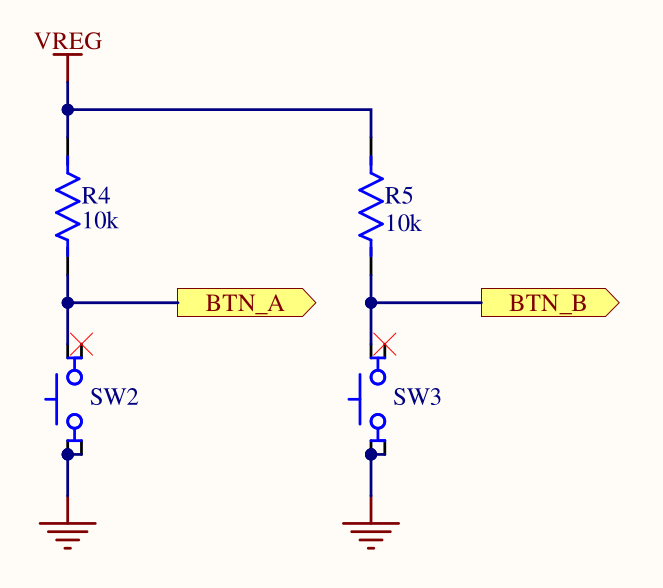
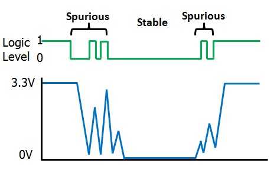

# Multi-tasking exercise and IPC

In this exercise, you will learn how to do pre-emptive multi-tasking with embassy. You will also
learn some basic ways to do communication between tasks, which is commonly called inter-process
communication (IPC).

## Multi-tasking on embedded systems

Most non-trivial embedded applications have to perform multiple tasks at once. Some
of these tasks might have real-time constraints which means that the tasks need to be performed
within a certain time frame.

You could write a super loop firmware, where a custom state machine takes care of performing
all tasks at once. However, this quickly gets unwieldy as the number of tasks grows. Furthermore,
it is error-prone when trying to fulfill real-time constraints because a CPU intensive task
in your state machine could violate those constraints.

In the C/C++ world, you would use a real-time operating system instead, which will always
include some way to schedule tasks which run concurrently. Concurrency is the general term
of performing multi-tasking on a computing system. It also works on single-core systems by
letting a scheduler switch between multiple tasks quickly.

There is a distinction between scheduling types:

- Pre-emptive scheduling - This type is more suitable for real-time requirements. Tasks can have
  priorities. If a higher-priority task needs work to be done, it will pre-empt a lower priority
  task to ensure the task gets done as quickly as possible. Pre-emption means that the scheduler
  will switch from the low priority tasks to the high priority task to service it as quickly
  as possible.
- Cooperating scheduling - Each task will run until completion or until the work is done. After
  that, the task will yield to the operating system, which means ceding control to the scheduler
  so it can start running other (higher-priority) tasks. This means that a low priority task could
  stop another high priority task from being executed in time.

Interrupts are a special case here. On Cortex-M [MCUs](./terminology_glossary.md) like the one
we have on the micro:bit, there is a distinction between thread mode and interrupt mode. Thread mode
is the default mode where the CPU executes your regular code. Interrupt mode is used when an
interrupt occurs and the CPU executes an interrupt handler. An interrupt will always pre-empt the
thread mode and can be treated like a pre-emptive task as well.

The default embassy executor runs all `async` tasks in cooperative mode. You need to cede control
in your `async` tasks by using `await` somewhere or a task might monopolize all the CPU time. This
makes it harder to ensure your system meets real-time requirements. Moreover, a task with a bug could
monopolize all the CPU time
and stop other tasks from running. Doing this is a bug on a pre-emptive system as well, but the
consequences are more direct on a system like this. You could use interrupts to allow fulfilling real-time
requirements on important tasks. However, for technical reasons, interrupt handlers must
be regular synchronous functions. Is it possible to have pre-emptive tasks while still being
able to use `async`? embassy provides the [InterruptExecutor](https://docs.rs/embassy-executor/latest/embassy_executor/struct.InterruptExecutor.html)
feature as the answer.

You can still have your regular `async` tasks, but they will now be scheduled by the interrupt mode
of the processor. The processor also allows assigning priorities to an interrupt handler, which
means that all the tasks scheduled by a certain interrupt handler inherit that handler's priority.

## Step 1 - Create a second task

The first step is to create a second task which prints something when the left user button (A)
is pressed. We actually provided a component that you can use for this. The [InputChannel](https://docs.embassy.dev/embassy-nrf/0.10.0/nrf52833/gpiote/struct.InputChannel.html)
can be used to listen for events on GPIO input channels, which includes voltage transitions
on those channels which occur when the button is pressed.

It is really simple to add a new task in `embassy`: Create a new `async fn <task_name>()`
and annotate it with the [`embassy_executor::task`](https://docs.rs/embassy-executor/latest/embassy_executor/attr.task.html)
attribute. You can even pass input arguments to the function, but you can not use lifetimes or
generics on the task function itself.

A task also needs to be spawned so the executor will schedule and run it. You can use the
[`spawner`](https://docs.rs/embassy-executor/latest/embassy_executor/struct.Spawner.html) for this
which is passed as an input argument to your main method. You need to pass the call of your new
`async` task to the [`spawn`](https://docs.rs/embassy-executor/latest/embassy_executor/struct.Spawner.html#method.spawn)
method for this to work.

<details>

Declaration of the new task:

```rust,no_run
#[embassy_executor::task]
async fn new_task() {
    loop {
        defmt::info!("my new task");
        embassy::time::Timer::after(Duration::from_secs(1)).await;
    }
}
```


and somewhere in your `main` function:

```rust,no_run
spawner.spawn(new_task().expect("spawning task failed"));
```


The `expect` or `unwrap` is okay here. The only case where spawning a function may fail is when
you are spawning multiple instances of the same task.

</details>

Now we want to actually check for edges (voltage transitions) on the GPIO input connected to the
button. For this, you need to pass the `button_left_async` driver object we provided for you
to the task. The type of this driver is `gpiote::InputChannel<'static>`. You can transfer this
driver to the task by declaring it as an input argument to your new task.

<details>

```rust,no_run
async fn left_button_task(left_button: gpiote::InputChannel<'static>) {
    loop {
        defmt::info!("my new task");
        embassy::time::Timer::after(Duration::from_secs(1)).await;
    }
}
```

and in your main:

```rust
spawner.spawn(new_task(button_left_async).expect("spawning task failed"));
```

</details>

### Debouncing a GPIO line

Before we talk about how you can check for button presses in software, we need to talk a bit about some
things that can happen on the GPIO digital line when you press the button.

A button is implemented as a mechanical switch. When you press the button, you are actually
closing the contacts of a circuit. You can have a look at how this is wired up in the following
image extracted from the schematic:



This is a really common way to connect a button to an input pin using a [pull-up resistor](https://en.wikipedia.org/wiki/Pull-up_resistor).
The Wikipedia link provides some more information, but we will provide a simplified explanation
here: Without the connection of the input pin to the supply voltage through a resistor, you would
have a floating pin without a determined state when the switch is open.
The pull-up resistor pulls the voltage on the pin up to the supply voltage when the switch is open
(button is not pressed), so you will measure a digital high when reading the input pin.
When the switch is closed (button pressed), you have a voltage divider, where all the voltage drops
across the pull-up resistor. Consequently, you will read a digital low when reading the input pin.

The problem with mechanical switches is that they can bounce, which means that you might see
fluctuations on the digital line when you press the button. The following image provides a nice
visualization:



These bounces can make the measurement of edges imprecise. You might measure multiple edge events
in software even when you only press the button once. To avoid this, you can debounce the button.
A really simple way to do this would be to perform the following sequence:

1. Wait for a high-to-low edge to occur
2. Wait for a small delay, for example 10 to 20 milliseconds
3. Wait for a low-to-high edge to occur. This might already be the case.
4. Wait for a small delay, for example 10 to 20 milliseconds
5. Go back to step 1.

Usually, you want to do something when you detect a button press. You can do this between step
3 and 4 or after step 4.

## Detecting edges on a GPIO line

You should have all the information you need now. The [`InputChannel`](https://docs.embassy.dev/embassy-nrf/0.10.0/nrf52833/gpiote/struct.InputChannel.html) driver provides an
`async` [`wait_for_high`](https://docs.embassy.dev/embassy-nrf/0.10.0/nrf52833/gpiote/struct.InputChannel.html#method.wait_for_high)
and [`wait_for_low`](https://docs.embassy.dev/embassy-nrf/0.10.0/nrf52833/gpiote/struct.InputChannel.html#method.wait_for_low)
method. Use these functions and implement a debounced button press detection.

<details>

```rust,no_run
#[embassy_executor::task]
async fn left_button_task(mut button_a: gpiote::InputChannel<'static>) {
    loop {
        button_a.wait_for_low().await;
        // Debounce the button.
        embassy_time::Timer::after(Duration::from_millis(20)).await;
        button_a.wait_for_high().await;
        // Debounce the button.
        embassy_time::Timer::after(Duration::from_millis(20)).await;
        defmt::info!("The left button was pressed");
    }
}
```
</details>

When you have implemented this, test this by flashing the app using `cargo run --bin multitasking-ipc`,
pressing the left button and observing the program output.

## Step 2 - Third task scheduled by an interrupt scheduler

Now, we want to run a third task which is responsible for doing the same process for the
right button. You can declare the task similarly to how you declared the second task. The only
thing that changes when using another scheduler is how the task is spawned.

Add the declaration of the third task which does the same logic, but for the right button
`right_button_async`.

<details>

```rust,no_run
#[embassy_executor::task]
async fn right_button_task(mut button_b: gpiote::InputChannel<'static>) {
    loop {
        button_b.wait_for_low().await;
        // Debounce the button.
        embassy_time::Timer::after(Duration::from_millis(20)).await;
        button_b.wait_for_high().await;
        // Debounce the button.
        embassy_time::Timer::after(Duration::from_millis(20)).await;
        defmt::info!("The right button was pressed");
    }
}
```
</details>

We mentioned that you can use the [`InterruptExecutor`](https://docs.rs/embassy-executor/latest/embassy_executor/struct.InterruptExecutor.html)
provided by embassy. You have to activate support for it with a feature, but we already did this for
you for the `embassy-executor` dependency. If you look at the API of the executor, you can see
that its methods are only available for instances with a `'static` lifetime. This means
that you have to create the executor as a global static. This is necessary anyway so you can
use it inside an interrupt handler.

Create a static variable `INTERRUPT_EXECUTOR` as a global. If you are not sure how the syntax
of this works: You can declare a static variable by using `static <VAR_NAME>: <VarType> = <Construction/Instantiation>`
In this case, the constructor is a call of the `new` method of the executor.

<details>

```rust,no_run
static INTERRUPT_EXECUTOR: embassy_executor::InterruptExecutor = embassy_executor::InterruptExecutor::new();
```

</details>

Now, you can use `start` method of the executor to start it. You need to assign an interrupt by
passing an [`Interrupt` enum variant](https://docs.embassy.dev/embassy-nrf/0.10.0/nrf52833/interrupt/enum.Interrupt.html)
to the method. The `start` method will pend the interrupt, causing it to fire immediately. It will also return
a spawner object that you can use to assign tasks to that executor.
You can use any interrupt normally dedicated for a hardware unit that we are not using, for example
the [`QDEC` variant](https://docs.embassy.dev/embassy-nrf/0.10.0/nrf52833/interrupt/enum.Interrupt.html#variant.QDEC).
Some CPU architectures offer dedicated software interrupts, but this one does not.

Call the `start` method in your main routine and store the spawner inside a `interrupt_exec_spawner`
object. Use the `QDEC` interrupt variant as the input argument. Do not run the code just yet!

<details>

Inside your main method:

```rust,no_run
let interrupt_exec_spawner = INTERRUPT_EXECUTOR.start(embassy_nrf::interrupt::Interrupt::QDEC);
```

</details>

You also need to declare an interrupt handler. If you did not do that, a default handler which is
an empty loop would be executed. Inside the interrupt handler, you need to call the [`on_interrupt` method](https://docs.rs/embassy-executor/latest/embassy_executor/struct.InterruptExecutor.html#method.on_interrupt)
of the interrupt executor. The `cortex-m-rt` run-time library takes care of exposing a mechanism
which allows us to declare interrupt handlers. You have to use the following import statement
to get access to the `interrupt` macro:

```rust,no_run
use embassy_nrf::interrupt;
```

Then, you can annotate a regular function with that exact macro. The function must have
the exact name of the enum variant we showed you earlier, in our case `QDEC`.

So this would look like:


```rust,no_run
use embassy_nrf::interrupt;

#[interrupt]
fn QDEC() {
    // Interrupt handler code here.
}
```

The special property of this function is that it is not called by software regularly.
Instead, this function is called by the hardware when the QDEC interrupt fires. Normally,
it would be used to service the QDEC peripheral, but we are using it to run our interrupt
scheduler now instead.

Call the interrupt executor `on_interrupt` method inside the interrupt handler. It is an `unsafe`
method because calling it has safety constraints that the compiler can not prove. In this
case, we can fulfill the constraints by only calling this function once in the correct
interrupt handler. It is good practice to document your unsafe code blocks with a `// Safety:`
note, so you should do that as well.

<details>

```rust
use embassy_nrf::interrupt;

#[interrupt]
fn QDEC() {
    // Safety: We only call this once inside the interrupt handler.
    unsafe {
        INTERRUPT_EXECUTOR.on_interrupt();
    }
}
```

</details>

Finally, you can use the `interrupt_exec_spawner` object inside your main method to spawn the third
task that you created.

<details>

Inside your main method:

```rust
let interrupt_exec_spawner = INTERRUPT_EXECUTOR.start(embassy_nrf::interrupt::Interrupt::QDEC);
interrupt_exec_spawner.spawn(right_button_task(button_right_async)).expect("spawning task failed");
```

</details>

Now verify that everything is working by running the application, pressing the right button (B)
and observing the program output.

## Step 3 - Signalling our main application

One common task in complex applications is the communication between concurrent tasks. This
is called inter-process communication (IPC). The `embassy` framework provides the
[`embassy-sync`](https://docs.embassy.dev/embassy-sync/0.8.0/default/index.html) library which
is an embedded and async friendly IPC library. We are going to use this library to facilitate
communication between the main task and the button tasks.

The [`Signal`](https://docs.embassy.dev/embassy-sync/0.8.0/default/signal/struct.Signal.html)
object provides a simple signalling mechanism which can be used to allow one task to notify
another one. In this case, your task will be to use this mechanism to notify the main task
about the button press. In the main task, you should listen to the signalling mechanism
and switch between two modes: An `On` mode where the LED is toggled periodically, and an `Off`
mode where it is off. You can create some enumeration to model these states, or you can just
use a boolean.

The signal mechanism is shared between tasks. The intended way to share it is to create
a static instance of it which can be used by both tasks. You can have a look at the
[`Signal` example code](https://docs.embassy.dev/embassy-sync/0.8.0/default/signal/struct.Signal.html).

Notice the first generic argument, which is a `CriticalSectionRawMutex` in this case. The
`Signal` abstraction takes care of synchronization internally to avoid data races, and allows
configuring the lock mechanism for that. In our case, we can use a cheaper synchronization
mechanism by using the [`ThreadModeRawMutex`](https://docs.embassy.dev/embassy-sync/0.8.0/default/blocking_mutex/raw/struct.ThreadModeRawMutex.html)
instead. It is valid to use this lock because we are on a single-core system and both of our tasks
are regular cooperative tasks running in thread-mode.

Create a static instance called `SIGNAL_LEFT_BUTTON`. The signal mechanism also allows
specifying some signal type as the second generic argument, which can be sent during a notification.
In this case, there is no additional information required, so a unit value `()` can be used.

<details>

```rust
static SIGNAL_LEFT_BUTTON: Signal<ThreadModeRawMutex, ()> = Signal::new();
```

</details>

All the [API](https://docs.embassy.dev/embassy-sync/git/default/signal/struct.Signal.html) on signal
only requires a shared reference, and you can use the `signal`, `wait` and `try_take` function to
signal from the button task and wait in the main task respectively.

In your task which waits for button A presses, add a call to the `signal` function after detecting
a button press.

<details>

```rust
#[embassy_executor::task]
async fn left_button_task(mut button_a: gpiote::InputChannel<'static>) {
    loop {
        button_a.wait_for_low().await;
        // Debounce the button.
        embassy_time::Timer::after(Duration::from_millis(20)).await;
        button_a.wait_for_high().await;
        // Debounce the button.
        embassy_time::Timer::after(Duration::from_millis(20)).await;
        SIGNAL_LEFT_BUTTON.signal(());
        defmt::info!("The left button was pressed");
    }
}
```

</details>

## Step 4 - Using the signal in the main task

In the main task, you also have the issue that you have to perform two tasks now: Handling the
blinking of the first task periodically while also doing the same for the second LED in combination
with checking the signal state. You could fix this with an additional task, but then you would have
to add some lock mechanism to share the LED strip across both tasks. Asynchronous Rust
also allows an alternative way to perform multiple tasks in the same `async` task.

The [`select`](https://docs.rs/embassy-futures/latest/embassy_futures/select/fn.select.html) API
allows polling two asynchronous tasks in the same loop. We have already imported the required
`embassy-futures` API for you. Concerning the application logic, it is usually still best
from a readability standpoint to have distinct `async` functions which perform their specialized
task. You can wrap the `LedStrip` driver in a [`core::cell::RefCell`](https://doc.rust-lang.org/core/cell/struct.RefCell.html)
and then pass a shared reference to that structure to each `async` function to share the driver
safely across multiple `async` functions. This is valid because the `async` functions are all
part of the same `async` task, so there is no way for one `async` function to pre-empt another,
which could cause multiple borrows of the driver. We are going to take care of creating
these `async` functions first.

Extract the existing task which toggles the top left LED into a distinct `async` task called
`main_led_task` first. Pass a shared reference to `RefCell<LedStrip<'a>>` to it. Also note that
the limitation that you are now allowed to use lifetimes only applies to `async` tasks
annotated by the `embassy_executor::task` macro.
You have to update the main task and call `borrow_mut` on the wrapper driver object to actually
retrieve and toggle the LED in the task now.

<details>

```rust
async fn main_led_task<'a>(led_strip: &RefCell<LedStrip<'a>>) {
    loop {
        led_strip.borrow_mut().toggle(0);
        Timer::after(Duration::from_millis(500)).await;
    }
}
```

</details>

We will now create the new `async` task for toggling the left LED and implementing the target logic.
We actually need two states now: A `TOGGLING` state and an `OFF` state, which is toggled when we are
signalled by the button task.

Create a boolean or an enumeration for modelling the state now. We recommend an explicit state
enumeration: It is more readable and allows easier extension. It makes sense to add a `toggle`
implementation to the enumeration as well for an even more readable API.

<details>

```rust
#[derive(Debug, Clone, Copy)]
pub enum BlinkState {
    Toggling,
    Off,
}

impl BlinkState {
    pub fn toggle(&mut self) {
        *self = match self {
            BlinkState::Toggling => BlinkState::Off,
            BlinkState::Off => BlinkState::Toggling,
        }
    }
}
```
</details>

Now create the second `async` task. Pass in the driver similarly to how you did it in the main LED
task. Create a new instance of your state variable and initialize it to the logical `OFF` state.

Start with a simple implementation which toggles the LED every 250 milliseconds if
the blink state is in the `TOGGLING` state.

```rust
async fn left_led_task<'a>(led_strip: &RefCell<LedStrip<'a>>) {
    let blink_state = BlinkState::Off;
    loop {
        if blink_state == BlinkState::Toggling {
            led_strip.borrow_mut().toggle(1);
        }
        Timer::after(Duration::from_millis(250)).await;
    }
}
```

Now, you actually need to add the logic to wait for a signal from the button task while also
performing the periodic waiting. You can use the same `select` API you used earlier to select
between two asynchronous tasks and stop on the first one which is resolved to completion.
In this case, you can `select` between the timer elapsing after 250 ms and the `wait` call
on the signal. Implement and use it in your task like explained. Calling the `select` method
creates a new future which you can `await`. It will return the [`Either`](https://docs.rs/embassy-futures/latest/embassy_futures/select/enum.Either.html)
object which notifies you which `async` event was resolved to completion.

Change your left blinky `async` function and call the `select` API to wait on both
the periodic delay and the wait method of the signal, whichever finishes first. Match on the
`await`ed select call.

In the branch for the periodic delay, toggle the LED if you are in the `TOGGLING` state.
In the branch for the signal handling, toggle the blink state variable. It makes sense to
also turn the LED off when going to the `OFF` state.

<details>

```rust
async fn left_blinky<'a>(led_strip: &RefCell<LedStrip<'a>>) {
    let mut blink_state = BlinkState::Off;
    loop {
        match embassy_futures::select::select(
            SIGNAL_LEFT_BUTTON.wait(),
            Timer::after(Duration::from_millis(250)),
        )
        .await
        {
            embassy_futures::select::Either::First(_) => {
                blink_state.toggle();
                if let BlinkState::Off = blink_state {
                    led_strip.borrow_mut().off(1);
                }
            }
            embassy_futures::select::Either::Second(_) => {
                if let BlinkState::Toggling = blink_state {
                    led_strip.borrow_mut().toggle(1);
                }
            }
        }
    }
}
```
</details>

Now, all that is left to do is to execute both the `left_blinky` and the `main_led_task`
inside your `main` task. As already mentioned, you can also use the `select` API for this, but
you do not need to match on the output of the `select` call. Instead, you can poll both of these
async tasks in a permanent loop.

<details>

At the end of your main task:

```rust
    let line_strip_shared = core::cell::RefCell::new(line_strip);
    loop {
        embassy_futures::select::select(
            main_led_task(&line_strip_shared),
            left_blinky(&line_strip_shared),
        )
        .await;
    }
```

</details>

You can now test this using `cargo run --bin multitasking-ipc`.

## Step 5 - Send a message from the third task on a button press

We now want to teach another common IPC mechanism: Message queues. The embassy [`Channel`](https://docs.embassy.dev/embassy-sync/0.8.0/default/channel/struct.Channel.html)
provides a static and typed message with async support. We are going to use this channel
to send information from the right button task to the main task.

We want to measure the amount of time the button was pressed in the button task and send that
duration to the main task. Then we can blink the button with that updated frequency.
Similarly to the channel abstractions offered by the Rust standard library, most channel libraries 
targeting embedded systems offer some way to be split up into a sender and receiver driver object.
The [`sender`](https://docs.embassy.dev/embassy-sync/0.8.0/default/channel/struct.Channel.html#method.sender)
and [`receiver`](https://docs.embassy.dev/embassy-sync/0.8.0/default/channel/struct.Channel.html#method.receiver)
allow this.

Similarly to the `Signal` object we used earlier, one of the easiest ways to share this channel
is to declare it as a global static object. Moreover, the lock object `M` required to avoid data
races needs to be specified again. This time, we can not use the `ThreadModeRawMutex` because the
sender is scheduled inside an interrupt handler and not in thread-mode. The
`CriticalSectionRawMutex` is the correct lock now. You also have to specify the size of the queue
statically as the `N` generic.

Create a static `CHANNEL_RIGHT_BUTTON` instance using the
`embassy_sync::channel::Channel<CriticalSectionRawMutex, embassy_time::Duration, 4>` type.

<details>

Above your main:

```rust
static CHANNEL_RIGHT_BUTTON: embassy_sync::channel::Channel<
    CriticalSectionRawMutex,
    embassy_time::Duration,
    4,
> = embassy_sync::channel::Channel::new();
```

</details>

The next step is to measure the duration of the button press. It is very easy to measure
durations using `embassy_time` because it offers abstractions similar to the standard library.
You can retrieve an `embassy_time::Duration` for the difference between two time points by
subtracting one embassy [`Instant`](https://docs.rs/embassy-time/latest/embassy_time/struct.Instant.html)
from another:

```rust,no-run
let start = embassy_time::Instant::now();
// Some operation which takes time
// (...)
// `elapsed` has the `embassy_time::Duration` type.
let elapsed = embassy_time::Instant::now() - start;
```

Use this to measure the button press duration in your right button task. Then use the
`CHANNEL_RIGHT_BUTTON` `sender` method to retrieve a sender handle and use its `send` method
to send the duration to the main task. The `send` method is an `async` function that needs
to be awaited.

<details>

```rust
#[embassy_executor::task]
async fn right_button_task(mut button_b: gpiote::InputChannel<'static>) {
    loop {
        button_b.wait_for_low().await;
        let now = embassy_time::Instant::now();
        // Debounce the button.
        embassy_time::Timer::after(Duration::from_millis(20)).await;
        button_b.wait_for_high().await;
        let elapsed = embassy_time::Instant::now() - now;
        // Debounce the button.
        embassy_time::Timer::after(Duration::from_millis(20)).await;

        CHANNEL_RIGHT_BUTTON.sender().send(elapsed).await;
        defmt::info!("The right button was pressed");
    }
}
```

</details>

## Step 6 - Handle blinky duration messages in main task

As the final step, process the received messages by using the `receiver` method of
`CHANNEL_RIGHT_BUTTON` and its `receive` method to receive the messages from the right button
task. You need a state variable to track the current blink frequency which is then updated
by the messages. You can start with a periodic frequency of 1000 milliseconds.

One way to cleanly do this is to extract this into a dedicated `async` function similarly to how
it was done for handling the signal of the left button task.

`embassy-futures` offers methods like [`select3`](https://docs.embassy.dev/embassy-futures/0.1.2/default/select/fn.select3.html) to allow selecting between more than 2 tasks.

<details>

Right blinky task:

```rust
async fn right_blinky<'a>(led_strip: &RefCell<LedStrip<'a>>) {
    let mut blink_freq = Duration::from_millis(1000);
    loop {
        match embassy_futures::select::select(
            CHANNEL_RIGHT_BUTTON.receiver().receive(),
            Timer::after(blink_freq),
        )
        .await
        {
            embassy_futures::select::Either::First(new_duration) => {
                defmt::info!("New blink frequency: {:?} ms", new_duration.as_millis());
                blink_freq = new_duration;
            }
            embassy_futures::select::Either::Second(_) => {
                led_strip.borrow_mut().toggle(2);
            }
        }
    }
}
```

main loop:

```rust
    let line_strip_shared = core::cell::RefCell::new(line_strip);
    loop {
        embassy_futures::select::select3(
            main_led_task(&line_strip_shared),
            left_blinky(&line_strip_shared),
            right_blinky(&line_strip_shared),
        )
        .await;
    }
```
</details>

## Finishing Up

Run `cargo run --bin multitasking-ipc` and try pressing the right button down for different
times. You should see the blink frequency change depending on how long you pressed the button.

You might have noticed that there are actually multiple ways to specify tasks. You can either
use `async` functions annotated with `#[embassy_executor::task]` or you use methods like
`join` or `select` provided by the [`embassy-futures`](https://docs.embassy.dev/embassy-futures/0.1.2/default/index.html)
crate. Which one is actually better? The [`embassy` book provides some notes on this](https://embassy.dev/book/index.html#_multiple_tasks_or_one_task_with_multiple_futures).
Generally, each separate task will require its own (static) RAM allocation, but using `select` or
`join` might require a little bit of more CPU time juggling futures.
The general recommendation is to use the easier solution because there is no large difference.
In our case, it made sense to handle the LED strip driver in one task because it is relatively
easy to share resources across `async` functions safely using `RefCell` and `Cell`.

You also saw the two primary schedulers that you can use in `embassy`. If you have deadlines
on a task or need priorities on tasks, you can use the [`InterruptScheduler`](https://docs.embassy.dev/embassy-executor/0.10.0/cortex-m/struct.InterruptExecutor.html) for this.

There are a lot more abstractions inside the `embassy-sync` crate that you might find useful.
For example, you can use the [`Pipe`](https://docs.embassy.dev/embassy-sync/git/default/pipe/struct.Pipe.html)
structure for byte-oriented data like the one received on a UART peripheral.

You also specified an interrupt handler using the `interrupt` macro provided by `cortex-m-rt` and
re-exported by the HAL. Interrupt handlers actually do not allow input arguments for technical
reasons. How do you share data with them when you actually need to or want to write your own?
Unfortunately, the only way here is to use global shared data. Considering that most interrupt
handlers have the primary purpose to service hardware peripherals, it is okay to also
instantiate low level device drivers for the assigned peripheral that interrupt handler serves
directly without any sharing or lock mechanism. Most PACs and HALs will provide that API. Then, you
can combine it with the data structures provided
by `embassy-sync` or with lock objects like [the embassy `Mutex`](https://docs.embassy.dev/embassy-sync/git/default/mutex/struct.Mutex.html)
or the [`critical-section` `Mutex`](https://docs.rs/critical-section/latest/critical_section/struct.Mutex.html)
to safely share or send data to your regular software tasks. Most `async` APIs for hardware drivers
relies on interrupt handlers to function properly. Luckily, most modern HALs offer
interrupt handlers with explicit support for `async`. `embassy` even goes one step further and
provides a convenient macro which declares this function for you so you can not forget to call
the function.
