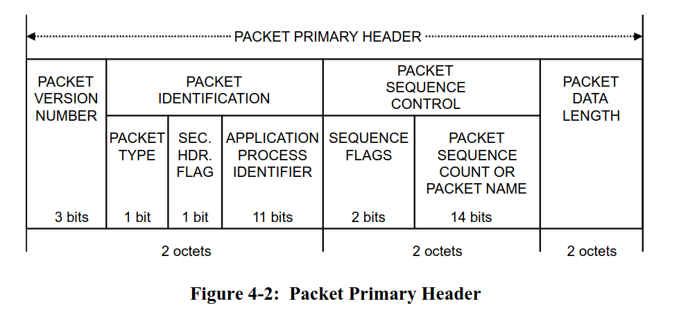

# Packet Communication and Serialization

In the aerospace domain, most communication between systems is done using binary protocols instead
of ASCII text-based protocols. Binary protocols are usually a lot more space-efficient
and are also easier to parse and implement than ASCII based ones.

Furthermore, we also need to exchange our data structures frequently. For example, the ground system
might want to send various parameters inside the telecommands, while the on-board software
might need to send something like sensor data back to the ground station.
The generic term used for converting your data structures into raw bytes and vice-versa is called
Serialization and Deserialization. 

In this exercise, you are going to learn about some proven ways to perform serialization and
deserialization of data in addition to using a really simple binary protocol stack.

## Serialization and Deserialization

In the embedded world, binary protocols based on tightly packed C types are still very common.
The method here is relatively simple. Assuming that all the data structures that you want to
exchange and send around are based on primitive types like `u8`, `u16`, `f32` etc., you just
pack those types and send their raw byte representation. For example, assuming that you want
to send some raw sensor data, which is represented by 3 `u16` values, one for each axes X, Y and Z,
you could pack the bytes into a 6 byte payload like this:


MSB is the most significant byte here while LSB is the least significant byte. It is very common
for binary exchange formats to use the [big endian data layout format](https://en.wikipedia.org/wiki/Endianness)
which is a bit easier for humans to interpret. Packing your data like this is relatively straightforward.

This serialization scheme we showed above is also interoperable with other programming languages.
However, it still has some disadvantages:

- You might have to swap the bytes to ensure MSB comes first if you have something like a 
  [little endian](https://en.wikipedia.org/wiki/Endianness) CPU architecture. It might not be
  sufficient to simply copy your primitive data into a buffer because the bytes in your RAM might
  have a different layout than the one you want in your buffer.
- You are hand-writing the serialization code. There are serialization libraries available
  which can do this for you. If you have a lot of data structures, the serialization code
  amount can be substantial. Every new piece of hand-written code is a potential source of bugs.
- If you send the data to another computer and use another programming language like Python,
  you also have to write the deserialization in another language.

Serialization is an extremely common task in the computing domain. When using Rust, the
[`serde` framework](https://serde.rs/) is the most popular solution for this task. It has
a very smart design that allows to make Rust data structures serializable by implementing
a trait on them, which is usually trivial thanks to the macro system provided by Rust. You can then
combine this with any serializer library that implements the `Serializer` trait provided by `serde`.

There are serializer implementations specifically targeting embedded systems. We are going to use
the [postcard](https://github.com/jamesmunns/postcard) library, which is a perfect fit for
embedded systems.

The largest advantage of using `serde` is that you do not have to hand-write serializers and
deserializers anymore. The only disadvantage is that this solution is not easily cross-language
interoperable. This means that when you exchange serde serialized payloads, the easiest way to deserialize
them is to use a Rust application as well. However, considering that Rust is an excellent tool
for writing small tools and clients on the computer as well, the combination of `serde` and `postcard`
has proven itself to be a very good solution for applications in our domain.

In this exercise, we will provide a more complex starter firmware application and a starter host
client that you run on your computer to communicate with the firmware via UART. The primary goal
will be to implement a simple communication protocol between the host computer which supports the
following requests and responses:

- `Ping` request
- `Ok` response for unit responses with no additional payload
- `RequestAccelerometer` request to specifically request housekeeping data.
- `Accelerometer` response which contains the accelerometer data
- `SetBlinkFrequency` to set the blink frequency.

## Binary protocols

The [OSI model](https://en.wikipedia.org/wiki/OSI_model) provides a good reference model how
a communication system might be structured. However, we do not necessarily need to implement all the
layers of the OSI model due to the increased complexity which is oftentimes not necessary for
simple point-to-point communication via simple protocols like UART.

One proven way is to only include a data-link layer and an application layer protocol. The
[COBS protocol](https://en.wikipedia.org/wiki/Consistent_Overhead_Byte_Stuffing) is an excellent
fit as a data-link layer because it is very simple and there are libraries available for Rust, C and
Python. This protocol works by removing all zeroes from a packet during an encoding process
and adding them back during the decoding process. You can then use zeroes to delimit your packet
or frames in the data stream.

This also allows recovery of the decoding process when there is a communication hiccup which
is something that can always happen. Parsing for frames or packets now simply involves scanning for
start and end markers (usually 0x0) and then decoding everything in between. If there is a
communication issue and data is lost, the protocol can resynchronize on the data stream when
the next start marker is found. [COBS](https://en.wikipedia.org/wiki/Consistent_Overhead_Byte_Stuffing)
is also computationally inexpensive and has a deterministic worst-case overhead.

The [CCSDS space packets protocol](https://ccsds.org/Pubs/133x0b2e2.pdf) is the most commonly
used application layer standard in the space domain. It only has one mandated component: A packet
primary header with 6 bytes.



- There is a packet type bit to determine whether a packet is a telecommand or a telemetry packet
- There is an application process identifier (APID) which can be used for various purposes, for
  example as an address ID or as a multiplexing and de-multiplexing ID.
- There is a packet sequence count which can be used on the application layer to detect missed
  packets.
- There is a data length field to figure out the length of the payload following the header.

Other than that, you are free to define the payload format yourself. Usually, it also is a good
idea to include a [CRC](https://en.wikipedia.org/wiki/Cyclic_redundancy_check) checksum at the
end of the payload which allows to verify data integrity as well. The checksum is computed from
the packet data based on a checksum polynomial. There are many types of
[CRC codes](https://reveng.sourceforge.io/crc-catalogue/16.htm), but one very commonly used CRC in
the space domain is the CRC-16-CCITT 16-bit checksum which is sometimes also called CRC-16-IBM3740.

Our final binary packet stack is the combination of the COBS data-link layer,
the CCSDS space packet standard containing a `serde` serialized payload and the CRC-16-CCITT 16-bit
checksum appended at the end. The packet stack is also visualized in the following diagram:

 

## Step 1 - Creating our `serde` compatible data models

Before we start defining the data structures that we serialize and exchange between our client
application on the computer and the firmware running on the micro:bit v2, let's talk about
the structure of our application. We mentioned that Rust simplifies the task of modularizing
and structuring your application. We are now going to apply this in practice.

The client and firmware app will both use the same data structures. We can move those shared
data structures into a `microbit-models` crate that is used by both apps.

Rust allows managing multiple crates by providing the [workspace](https://doc.rust-lang.org/cargo/reference/workspaces.html)
feature. Unfortunately, mixed target workspaces do not work well. This is the reason we provide
two workspaces: The `firmware` workspace which only contains applications and libraries compatible
to the micro:bit v2 target system, and the `host` workspace which contains components like the
client app or the shared data models library. This is a project structure that we can recommend,
especially as your project grows or when you have one mono-repo for multiple boards and projects.

We are going to create the models library from scratch. Go into the `host` folder and run
the following command:

```console
cargo init --lib microbit-models
```

This will create a skeleton library for you. It will also add it to the workspace automatically
by updating the `host/Cargo.toml` workspace file.

Next, open the crate configuration file `host/microbit-models/Cargo.toml` which was created for
you and add the following line below the `[dependencies]` table:

```toml
[dependencies]
serde = { version = "1", features = ["derive"] }
```

Next, we are going to create the data model types for our requests and responses. In this case,
you have a clearly defined set of requests and responses that you need. Rust provides a perfect
solution for this: The `enum` type which can do so much more than the simplistic Python or C/C++
enumeration types.

Open the `host/microbit-models/src/lib.rs` file. Add a `#![no_std]` attribute at the top first.
We do not need the standard run-time in our crate, and we would not be able to use the library
in our firmware application if the run-time was included.

After that add a response module and a request module. Now add a `request.rs` and a `response.rs`
file to the `src` folder. After that, add the `pub mod request` and `pub mod response` directives
to `lib.rs` to include the newly added modules. If you have no idea what's going on, work
through the [Rust book chapter on modules](https://doc.rust-lang.org/book/ch07-00-managing-growing-projects-with-packages-crates-and-modules.html).

<details>
Inside lib.rs:

```rust
#![no_std]
pub mod request;
pub mod response;
```
</details>

Inside the `request.rs` file, define a `Request` enumeration which includes a ping, the request
HK unit variant and a variant to set the blink frequency. You can use the `core::time::Duration`
as the type for the frequency parameter.

```rust
pub enum Request {
    Ping,
    RequestAccelerometer,
    SetBlinkFrequency(core::time::Duration)
}
```

Note how our enum can now carry additional parameter information. Keep in mind that the compiler
will always reserve the size of the large variant on the stack when creating the enum variant.
If you want to supply something like large binary data, it might be better
to supply this as an arbitrary byte buffer behind the serde payload to avoid large and
expensive stack allocations. For the majority of parameters, supplying the parameters directly
like this is a good solution. One large advantage of this solution is that a `match` on the
unpacked `Request` type always enforces that all request variants need to be handled. We
leverage the type system of Rust to our advantage.

However, we are not done yet. You still have to add a few `derive` attributes to the enumeration.

- Generally, you always want to add the debug `Debug` derive.
- The `Copy` derive makes sense if your data structure is small and copying is cheap. Our data
  structure might grow larger in the future, but right now it is relatively small, so `Copy`
  would be okay
- The `Clone` derive always makes sense for our request parameter and allows users to make
  possibly expensive copies of the request type.
- The `serde::Serialize` derive makes our data structure serializable.
- The `serde::Deserialize` derive makes our data structure deserializable.
- The `PartialEq` and `Eq` derive allow doing equality checks on our request variants and are
  useful here.

Add all of these derives.

<details>

```rust
#[derive(Debug, Copy, Clone, serde::Serialize, serde::Deserialize, PartialEq, Eq)]
pub enum Request {
    Ping,
    RequestAccelerometer,
    SetBlinkFrequency(core::time::Duration)
}
```
</details>

We also want to print out requests using the `defmt` library. For this, we actually can just
use the `defmt::Format` derive. However, we need to feature gate this derive behind a `defmt`
feature because `defmt` will not compile for standard systems like your host computer for
technical reasons.

You can add a `defmt` feature to your models library by adding the following entry to your
`Cargo.toml` dependency list:

```toml
[dependencies]
serde = { version = "1", features = ["derive"] }
defmt = { version = "1", optional = true }
```

The `optional = true` will create an implicit `defmt` feature. The firmware can now activate
the `defmt` feature of the models library while host tools can leave it deactivated.

Add this `defmt` feature-gated derive to your `Request` type. The [`cfg_attr`](https://doc.rust-lang.org/reference/conditional-compilation.html#the-cfg_attr-attribute)
built-in attribute can help with this. If you have no idea how this
works, look at the solution below:

<details>

```rust
#[derive(Debug, Copy, Clone, serde::Serialize, serde::Deserialize, PartialEq, Eq)]
#[cfg_attr(feature = "defmt", derive(defmt::Format))]
pub enum Request {
    Ping,
    RequestAccelerometer,
    SetBlinkFrequency(core::time::Duration)
}
```
</details>

Now, do the same for the responses inside the `Response` module. We want
a `CommandCompleted`, and `AccelerometerData`. The `AccelerometerData` variant should contain
the accelerometer data, but we actually have not defined a model for this type yet.

Define an `AccelerometerData` structure which has 3 `i16` fields with the value in mg SI-units
for each axis first. Include all the derive attributes shown above as well.

```rust
#[derive(Debug, Copy, Clone, serde::Serialize, serde::Deserialize, PartialEq, Eq)]
#[cfg_attr(feature = "defmt", derive(defmt::Format))]
pub struct AccelerometerData {
    x_mg: i16,
    y_mg: i16,
    z_mg: i16
}
```
</details>

Now, define the `Response` enumeration like specified above.

<details>

```rust
#[derive(Debug, Copy, Clone, serde::Serialize, serde::Deserialize, PartialEq, Eq)]
#[cfg_attr(feature = "defmt", derive(defmt::Format))]
pub enum Response {
    CommandCompleted,
    AccelerometerData(AccelerometerData)
}
```
</details>

We have now modelled everything that we require!

> You can find the intermediate solution inside `host/microbit-models-solution`.

## Step 2 - Sending a ping command from the host client
