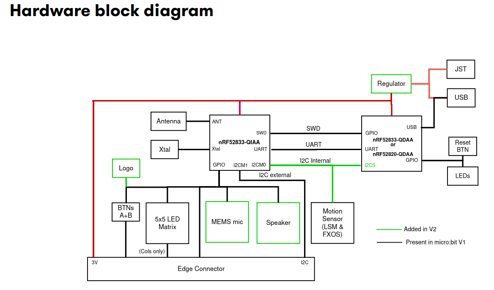

# UART echo application

The end goal of this task is to communicate with the serial port of the micro:bit.
A very common interface to allow communication with a microcontroller is the
[UART protocol](https://en.wikipedia.org/wiki/Universal_asynchronous_receiver-transmitter).

This is a protocol which facilitates communication through two physical pins, a transmit pin
called TX and a receive pin RX. You cross-wire the TX pin of one side to the RX pin of
the other side and vice-versa. Both sides have to agree on the communication speed which
is commonly called baudrate.

The specific task is an echo application: Everything that is received on the RX
pin of the microcontroller UART should be sent back to the sender via the TX pin.

## The micro:bit UART interface

The micro:bit v2 has a very convenient feature which allows us to talk with one of its UART
interfaces via the USB interface you already have. Have a look at this hardware block diagram
taken from the [website](https://tech.microbit.org/hardware/):



The nRF52833-QIAA block on the left side is the target MCU we are always programming. The
other microcontroller on the right side is the interface microcontroller. When we talk to the UART
of the target MCU, or we use `probe-rs` to flash new software to the target or read/write to its
RAM, we always do this through the interface MCU. The interface MCU exposes the serial port
via its USB interface as a so called USB-CDC device, where CDC is an abbreviation for
Communication Device Class.

Install the `cyme` tool using the following command:

```console
cargo install cyme
```

Then run the command `cyme` with the micro:bit connected via USB. You should see a line like
this:

```sh
  3   6  0x0d28 0x0204 BBC micro:bit CMSIS-DAP     9906360200052820ea998ce1eddd4919000000006e052820 -       12.0 Mb/s
```

Next, you can figure out the actual device name that you have to use to talk with the MCU by running
the following command on Linux:

```sh
❯ ls -l /dev/serial/by-id/*
(...)
lrwxrwxrwx - root 12 Jun 09:39 /dev/serial/by-id/usb-Arm_BBC_micro:bit_CMSIS-DAP_9906360200052820ea998ce1eddd4919000000006e052820-if01 -> ../../ttyACM0
```

On Windows, you can instead use this command in the PowerShell terminal:

```sh
Get-WmiObject Win32_SerialPort | Select-Object Name,Description
```

## Connecting to the UART interface - Linux

These instructions are Linux specific. Check the next segment for Windows specific instructions.

There are various programs available to connect to a serial port. For example, you can install
[`picocom`](https://linux.die.net/man/8/picocom) and then run the following command:

```console
picocom -b 115200 /dev/ttyACM0
```

Your device name might be different! It is named `/dev/ttyACM0` because that was the output of
`ls -l /dev/serial/by-id/*`. Change this for your command if necessary.

## Connecting to the UART interface - Windows

There are various programs available to connect to a serial port. On Windows, you can install
[PuTTY](https://putty.org/index.html) and then connect to the serial port using the COM port
name you found before.

You need to use the Serial connection type and specify a speed of 115200. This could look
something like this:


You can then open the connection to open a session connected to the serial port of the MCU.

## UART hardware

Before we start writing code, let's look at the hardware first.
We mentioned that UART uses 2 physical pins. This means that two of the GPIO pins of the micro:bit
need to be configured so they can be used by the UART hardware block for communication.

For a peripheral like UART, it is very common that a microcontroller support a larger selection
of pins to be assigned to the UART. Similarly to the blinky exercise where LED control is mapped
to certain GPIO pins, there is a pin mapping which depends on the board design.

You can either look at the [pin map](https://tech.microbit.org/hardware/schematic/) or
the [schematic](./assets/MicroBit_V2.0.0_S_schematic.PDF) to find the GPIO pin assignment.
Please note that the pin assignment in the pin map is inverted (so RX in actually TX for your driver and vice-versa) because it is done from the view of the interface MCU, not the target MCU. Try to
figure the pin mapping out on your own.

<details>

The TX target MCU pin is mapped to P0.06 while the RX target MCU pin is mapped to P1.08.

</details>

The micro:bit also has multiple UART instances. It allows using both of them, and we are going
to use instance 0.

## Some background information: Interrupts and direct memory access (DMA)

In the next segment, we will mention interrupts. The HAL we are using abstracts a lot of things
away from us, but it does not hurt to have a basic understanding of what is happening
behind the scenes.

In computing systems, processing important events in a timely manner is oftentimes done
using [interrupts](https://en.wikipedia.org/wiki/Interrupt). A really simple analogy: When the
door bell rings or someone calls you, you will generally drop whatever you are doing right now to
open the door or answer the phone call.

Mapping this analogy on a computer system, the delivery man ringing your door bell is the UART
peripheral informing you about the data delivery, while you are the processor.
When the hardware peripheral fires an interrupt, the CPU will stop whatever it is doing to service
the peripheral, and then go back to whatever it was doing before. Depending on how the
hardware is designed, you can do a lot of work with interrupts.

Some MCUs are designed in a way which allows hardware peripherals to access memory like RAM
directly. This technique is called direct memory access (DMA). Combining interrupts and DMA
allows to perform something like large data transfers with minimal CPU intervention.

The UART driver provided by the HAL that we are going to use combines both of these concepts as well.

## Step 1 - Create a UART driver

In the previous exercise, we created a driver for a GPIO pin. Now, we create a driver for another
hardware module: The UART. The HAL we are using provides a driver for us.

Read the [`uarte` module docs in embassy](https://docs.embassy.dev/embassy-nrf/git/nrf52833/uarte/index.html)
first. There are two flavors of this driver: A buffered one and a more simple one. In this example,
and for most of the applications in our domain, we generally want to ensure that we never lose
data, ideally independent of whatever the software is doing. A detailed explanation of how
this can be done would exceed the scope of this task, but you can assume that you need the
buffered flavor to not lose data between read calls, so that is what we are going to use.

Have a look at the [constructor documentation](https://docs.embassy.dev/embassy-nrf/git/nrf52833/buffered_uarte/struct.BufferedUarte.html#method.new)
of the buffered UART. It has 11 arguments! The driver is relatively complex, and the constructor
is not spared from that. It allows reliable communication and exposes an elegant API though.

Remember that the `Peri` type is always used for resource management types and comes from the
peripheral singleton field which is named `_periphs` in our example. Remove the leading underscore,
because we are going to use this type now.

Let's go through the arguments of the constructor one by one. You do not need to understand
all of the details here but they are mentioned for completeness.

- `uarte` - This is the UART instance we want to use. For our solution we are going to use instance 0
  but the hardware allows to use instance 1 as well.
- `timer` - The driver needs one of the hardware timer blocks to count the number of received bytes.
  You can use any unused timer instance here.
- `ppi_ch1` - This is used to connect the UART hardware to the timer hardware for byte counting. Have
  a look at the [PPI docs](https://docs.nordicsemi.com/r/bundle/ps_nrf52840/page/ppi.html) if you
  are interested in more information of this hardware feature. You can pass any unused PPI channel
  instance here.
- `ppi_ch2` - This is used for implementing permanent reception on the RX side in the background
  using DMA and interrupts. You can pass any unused
  PPI channel instance here.
- `ppi_group` - Required so that the PPI channel 2 can disable itself on certain events. You can
  pass any PPI group instance here.
- `rxd` - This is the physical GPIO pin which should be used as the RX pin. We figured out which pin
  this is in a previous section.
- `txd` - This is the physical GPIO pin which should be used as the TX pin. We figured out which
  pin this is in a previous section.
- `irq` - This is something embassy HAL specific. The driver relies on an interrupt handler being
  called for the UART. For technical reasons, that handler can not be specified in the HAL itself.
  Instead, the HAL provides a function that you should call on an interrupt, and we need to call
  this function in our own interrupt handler. However, the HAL provides a nice little macro
  that does this for us and creates a token structure for us. We need to provide that token structure
  to the HAL driver as proof that we have specified an interrupt handler.
- `config` - Configuration of the UART parameters. UART has various configurable parameters, and
  both communication partners have to agree on the same parameters. Usually, the most important
  parameter here is the baudrate.
- `rx_buffer` - Buffer used by the driver to permanently receive data in the background. The
  driver uses a double buffering scheme in the background to allow permanent reception of data.
- `tx_buffer` - Buffer used by the driver to transmit data.

Phew, that is a lot! We are going to provide multiple hints to simplify this task, in addition
to the hints you can derive from the information above.

Your task is to create the driver and store it with the name `uart`.

Embassy provides a `bind_interrupts!` which declares an interrupt handler for you, which
is necessary for proper function of the UARTE driver. Have a look at its
[documentation](https://docs.embassy.dev/embassy-nrf/git/nrf52833/index.html).
Use this macro to declare an interrupt handler for the UARTE. Keep in mind that it is sufficient
to declare an interrupt handler. The hardware takes care of calling it when required.

<details>

Write this above your `main` method.

```rust
use embassy_nrf::{buffered_uarte, peripherals};

embassy_nrf::bind_interrupts!(
    struct Irqs {
        UARTE0 => buffered_uarte::InterruptHandler<peripherals::UARTE0>;
    }
);
```

</details>

If you are struggling with figuring out the UART configuration, remember that we want to use
a baudrate of 115200 and that we can use the `default` configuration otherwise.

<details>

```rust
use embassy_nrf::uarte;

let mut uarte_config = uarte::Config::default();
uarte_config.baudrate = uarte::Baudrate::BAUD115200;
```

</details>

If you can not figure out how the buffers are specified:


<details>

```rust
    let mut driver_rx_buf: [u8; 256] = [0; 256];
    let mut driver_tx_buf: [u8; 256] = [0; 256];
```

Of course, other sizes work as well, but multiples of 128 are common. The size MUST be even
for technical reasons.

</details>

For all other arguments, you have to pass in fields of the `periphs` structure.

The full solution of this step:

<details>

```rust
    let mut uarte_config = uarte::Config::default();
    uarte_config.baudrate = Baudrate::BAUD115200;
    let mut driver_rx_buf: [u8; 256] = [0; 256];
    let mut driver_tx_buf: [u8; 256] = [0; 256];
    let uart = buffered_uarte::BufferedUarte::new(
        periphs.UARTE0,
        periphs.TIMER0,
        periphs.PPI_CH0,
        periphs.PPI_CH1,
        periphs.PPI_GROUP0,
        periphs.P1_08,
        periphs.P0_06,
        Irqs,
        uarte_config,
        &mut driver_rx_buf,
        &mut driver_tx_buf,
    );

```
</details>

Not all UART driver initialization will be that complex! This is actually a very capable, but
also very complex driver. There are other UART hardware implementations out there that do not
support DMA but that are also less complex. Generally, most driver constructors will at the minimum consume pin
resource handles and the UART resource handle while also expecting some UART configuration.

## Step 2 - Split the driver into an RX and TX handle

Many Rust UART drivers allow splitting themselves up into separate RX and TX handles. For example,
you might be interested in handling reception and transmission in separate tasks or doing them
concurrently. Many hardware implementations can also support this. This driver has
a [`split` method](https://docs.embassy.dev/embassy-nrf/git/nrf52833/buffered_uarte/struct.BufferedUarte.html#method.split).

Create distinct `uart_rx` and `uart_tx` driver handles.


<details>

```rust
    let (mut uart_rx, mut uart_tx) = uart.split();
```

These are already mutable because the methods we are going to use require mutable access.

</details>

## Step 3 - Read into a reception buffer inside a loop

Now we want to read something from the UART. You can use the `uart_rx` driver to do this. It has
an  [`async` `read` method](https://docs.embassy.dev/embassy-nrf/git/nrf52833/buffered_uarte/struct.BufferedUarteRx.html#method.read)
you can use for this purpose.

We need a separate buffer for this again. The buffer that we already declared is used exclusively
by the driver. You can create a new buffer similarly to the way you created the first one.
You can use a size like 64 or 128 here. Generally, it often makes sense to determine the
dimension based on the maximum expected packet size.

Your task is to asynchronously read into a buffer. Do a match call on the resulting
`Result` so that you can do clean error handling as well. Keep in mind that you also need to
call `await` on the `read` call because it is an `async` function. Create the buffer before
the loop call because there is no need to re-instantiate it for every `read` call.

<details>

```rust
    let mut rx_buf: [u8; 64] = [0; 64];
    loop {
        match uart_rx.read(&mut rx_buf).await {
            Ok(_bytes_received) => (),
            Err(_e) => ()
        }
    }
```

</details>

## Step 4 - Write back whatever was received

Now, we want to send back everything we received. In the `Ok` case, we will have access
to the number of received bytes. This can also be smaller than the full buffer size!

In the `Ok` arm of the match statement on the `read` call, use the [`write_all` method](https://docs.embassy.dev/embassy-nrf/git/nrf52833/buffered_uarte/struct.BufferedUarteTx.html#method.write_all) of
`uart_tx`. You also need to import the `embedded_io_async::Write` trait for this to work.
Remember that you want to send the number of bytes you actually received back, not the full buffer.


<details>

```rust
    let mut rx_buf: [u8; 64] = [0; 64];
    loop {
        match uart_rx.read(&mut rx_buf).await {
            Ok(read_bytes) => {
                match uart_tx.write_all(&rx_buf[0..read_bytes]).await {
                    Ok(_) => ()
                    Err(_e) => ()
                }
            }
            Err(_e) => ()
        }
    }
```

</details>

## Step 5 - Verifying everything works

Now, after you have flashed this application using `cargo run --bin uart_echo`, you send
anything to the MCU and it should be sent back. When you use an application like `picocom` or
`PuTTY`, this has the side effect that it looks like you are typing on a console.

Test that your echo application works properly by connecting to the serial port like
we explained earlier and typing anything. You should now see everything you type appear on
your terminal application, because your terminal app just displays what it received back
from the MCU, which is what you typed.

## Finishing Up

You are able to send and receive data to the MCU from your computer via UART now! The UART echo application
is oftentimes the "Hello World" of UART applications. This one is actually quite capable.
There are some things that can be improved in our app. For example, you could add proper
error handling for the `Err(e)` match arms, which could at the minimum include a `defmt::warn!` or
`defmt::error!` log.

Some interesting information: When you asynchronously call `read` and nothing is arriving on
the RX pin, the CPU can actually do other stuff! All the reception is handled in the background
by the dedicated interrupt handler provided by our HAL. Similarly, while you are writing
data out asynchronously using `write` and/or `write_all`, all the driver needs to do is
pass the address and the transfer size to the hardware. All the rest is done by the hardware
using DMA.

Practical applications in our domain will oftentimes use binary protocols. In principle, we could
send binary packets to this application and we would also receive those back. However, using a utility
like `picocom` allows for nice visualization that everything is working.

There is an [UART Spacepackets](./uart-spacepackets.md) exercise where we communicate with an MCU
using standardized [CCSDS spacepackets](https://ccsds.org/Pubs/133x0b2e2.pdf) via the serial interface.
This communication pattern is very commonly used at the IRS!
