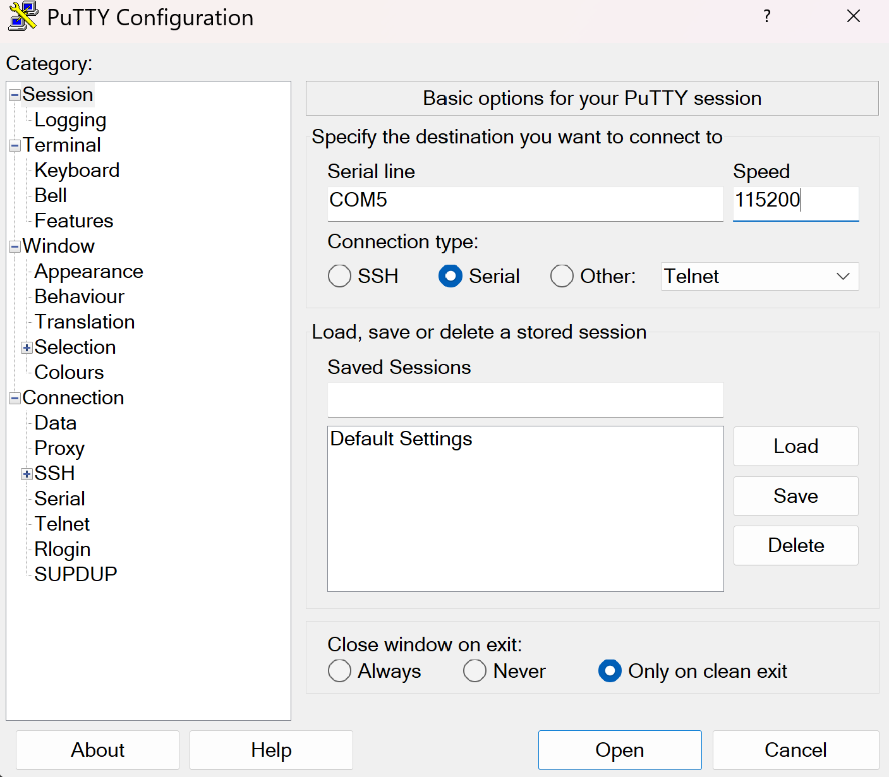

# UART echo application

The end goal of this task is to communicate with the serial port of the microbit v2.
A very common interface to allow communication with a microcontroller is the
[UART protocol](https://en.wikipedia.org/wiki/Universal_asynchronous_receiver-transmitter).

This is a protocol which facilitates communication through two physical pins, a transmit pin
called TX and a receive pin RX. You cross-wire the TX pin of one side to the RX pin of
the other side and vice-versa. Both sides have to agree on the communication speed which
is commonly called baudrate.

## The microbit v2 UART interface

The microbit v2 has a very convenient feature which allows use to talk with one of its UART
interfaces via the USB interface you already have. Have a look at this hardware block diagram
taken from the [website](https://tech.microbit.org/hardware/):


The nRF52833-QIAA block on the left side is the target MCU we are always programming. The
other microcontroller on the right side is the interface microcontroller. When we talk to the UART
of the target MCU, or we use `probe-rs` to flash new software to the target or read/write to its
RAM, we always do this through the interface MCU. The interface MCU exposes the serial port
via its USB interface as a so called USB-CDC device, where CDC is an abbreviation for
Communication Device Class.

Install the `cyme` tool using the following command:

```console
cargo install cyme
```

Then run the command `cyme` with the microbit v2 connected via USB. You should see a line like
this:

```sh
  3   6  0x0d28 0x0204 BBC micro:bit CMSIS-DAP     9906360200052820ea998ce1eddd4919000000006e052820 -       12.0 Mb/s
```

Next, you can figure out the actual device name that you have to use to talk with the MCU by running
the following command on Linux:

```sh
❯ ls -l /dev/serial/by-id/*
(...)
lrwxrwxrwx - root 12 Jun 09:39 /dev/serial/by-id/usb-Arm_BBC_micro:bit_CMSIS-DAP_9906360200052820ea998ce1eddd4919000000006e052820-if01 -> ../../ttyACM0
```

On Windows, you can instead use this command in the PowerShell terminal:

```sh
Get-WmiObject Win32_SerialPort | Select-Object Name,Description
```

## Connecting to the UART interface - Linux

These instructions are Linux specific. Check the next segment for Windows specific instructions.

There are various programs available to connect to a serial port. For example, you can install
[`picocom`](https://linux.die.net/man/8/picocom) and then run the following command:

```console
picocom -b 115200 /dev/ttyACM0
```

Your device name might be different! It is named `/dev/ttyACM0` because that was the output of
`ls -l /dev/serial/by-id/*`. Change this for you command if necessary.

## Connecting to the UART interface - Windows

There are various programs available to connect to a serial port. On Windows, you can install
[PuTTY](https://putty.org/index.html) and then connect to the serial port using the COM port
name you found before.

You need to use the Serial connection type and specify a speed of 115200. This could look
something liket his:



You can then open the connection to open a session connected to the serial port of the MCU.

## First step - Create a UART driver

In the previous exercise, we created a driver for a GPIO pin. Now, we create a driver for another
hardware module: The UART. The HAL we are using provides a driver for us.
